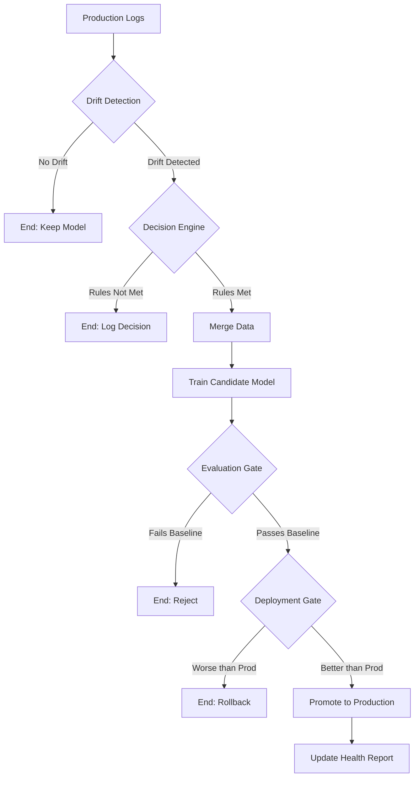

# 🏗️ MLOps Platform Architecture & Design

This document provides a deep dive into the technical architecture, design philosophy, and safety mechanisms of the Car Sales Prediction MLOps Platform.

---

## 1. System Architecture

The platform follows a **Modular Monolith** architecture designed for high observability and safety. It is composed of four primary layers:

### A. Data & Validation Layer
- **Source**: Raw CSV data and real-time API logs.
- **Engine**: Pydantic-based schema enforcement and statistical range validation.
- **Responsibility**: Ensures that only "clean" data enters the training or monitoring pipelines.

### B. Training & Versioning Layer
- **Engine**: Scikit-learn pipelines with custom transformers.
- **Tracking**: **MLflow** for experiment management (params, metrics, artifacts).
- **Versioning**: DVC (Data Version Control) for dataset hashing and reproducibility.

### C. Monitoring & Decision Layer
- **Drift Detection**: Statistical comparison (PSI, KS-Test) between training and production distributions.
- **Decision Engine**: A rule-based deterministic layer that evaluates if retraining is necessary.

### D. Deployment & Automation Layer
- **Orchestration**: Python-based pipeline runner.
- **Automation**: GitHub Actions for scheduled execution.
- **Safety**: Multi-stage gates (Evaluation Gate & Deployment Gate).

---

## 2. Decision Flow

The following flow represents the autonomous lifecycle of a model update:

---

## 3. Retraining Logic

The system uses a **Hybrid Statistical Approach** to trigger retraining:

### Feature Drift (PSI & KS Test)
- **Population Stability Index (PSI)**: Measures the magnitude of distribution shift.
    - `PSI < 0.1`: Stable
    - `0.1 < PSI < 0.2`: Minor Shift
    - `PSI > 0.2`: Significant Shift (Trigger)
- **KS Test**: Provides a p-value for the null hypothesis that two samples come from the same distribution.

### Prediction Drift
- Compares the distribution of current predictions against the original training target distribution.
- Uses **Mean Shift** and **Variance Analysis** to detect model "hallucination" or bias.

### Retraining Rules (Strict AND)
1. **Feature Drift Score** > 0.2
2. **Prediction Drift p-value** < 0.05
3. **New Samples** >= 50
4. **Cooldown** > 24 Hours

---

## 4. Safety Mechanisms

The platform is built on the principle of **"Defense in Depth"**:

| Mechanism | Level | Purpose |
| :--- | :--- | :--- |
| **Schema Guard** | Data | Prevents training on corrupted or missing features. |
| **Statistical Guard** | Data | Aborts if production data ranges are physically impossible. |
| **Evaluation Gate** | Model | Ensures new models beat a simple baseline (Mean/Median). |
| **Deployment Gate** | Model | Prevents "Silent Degradation" by comparing Candidate vs Production RMSE. |
| **Cooldown Timer** | Process | Prevents system thrashing and excessive compute costs. |
| **Atomic Promotion** | Deployment | Ensures the API always has a valid model loaded during updates. |

---

## 5. Technical Tradeoffs

### Rule-Based vs. ML-Based Decision
- **Chosen**: Rule-Based.
- **Why**: In production MLOps, **explainability is more valuable than complexity**. A rule-based engine is deterministic and easy to audit by senior engineers.

### Batch vs. Online Retraining
- **Chosen**: Batch (Scheduled).
- **Why**: Car sales data doesn't shift by the second. Batch retraining reduces infrastructure costs and allows for more thorough validation before promotion.

### Local Storage vs. Model Registry
- **Chosen**: Local File-based (with MLflow tracking).
- **Why**: For this scale, a full Model Registry (like Databricks) adds unnecessary latency and cost. Local storage with MLflow provides 90% of the benefits with 10% of the complexity.

---

## 6. Observability Philosophy

We believe that **"If it isn't logged, it didn't happen."**
- **Retraining History**: A permanent audit trail of every "Why" behind a model update.
- **System Health**: A high-level dashboard for stakeholders to monitor ROI and stability.
- **MLflow**: A deep-dive tool for data scientists to debug model performance.

---
**Author**: Antigravity MLOps Engine
**Status**: Production-Ready
**Version**: 1.0.0
